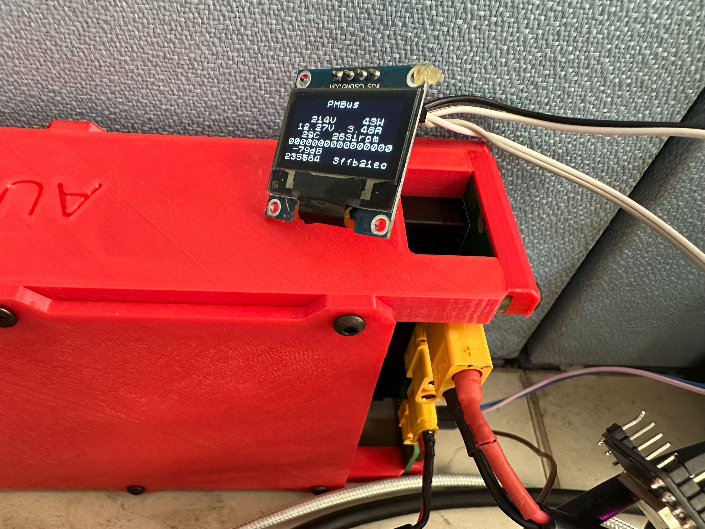
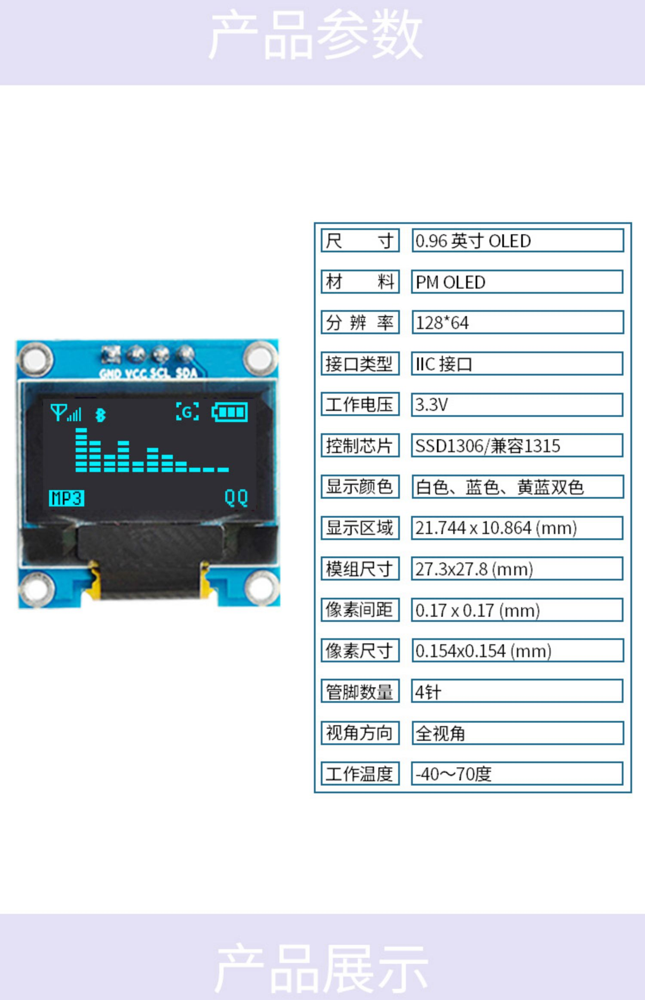

# 光宝，华为系列电源功率，电压电流，风扇转速读取程序

本程序使用Arduino开发，在光宝  PS-2461-1H-12C上调试通过

支持oled显示和web显示

通过ESP32的26，27连接电源的SDA，SCL口，电源内置上拉，可以直接连接
通过ESP32的21，22连接oled的SDA，SCL口，显示

oled的型是SSD1306，4针I2C接口的

This is an Arduino program designed to read power, voltage, current, and fan speed data from the Power Supply Units of the Huawei and Delta brands. It has been tested on the Delta PS-2461-1H-12C power supply.

This program supports both OLED display and web display. It connects to the power supply's SDA and SCL pins via the ESP32's 26 and 27 pins, respectively. The power supply has built-in pull-ups, so it can be connected directly. The SSD1306 OLED display is connected to SDA and SCL pins via the ESP32's 21 and 22 pins, respectively.

The OLED display uses a 4-pin I2C interface.

* Libraries
  * https://github.com/olikraus/u8g2
 
