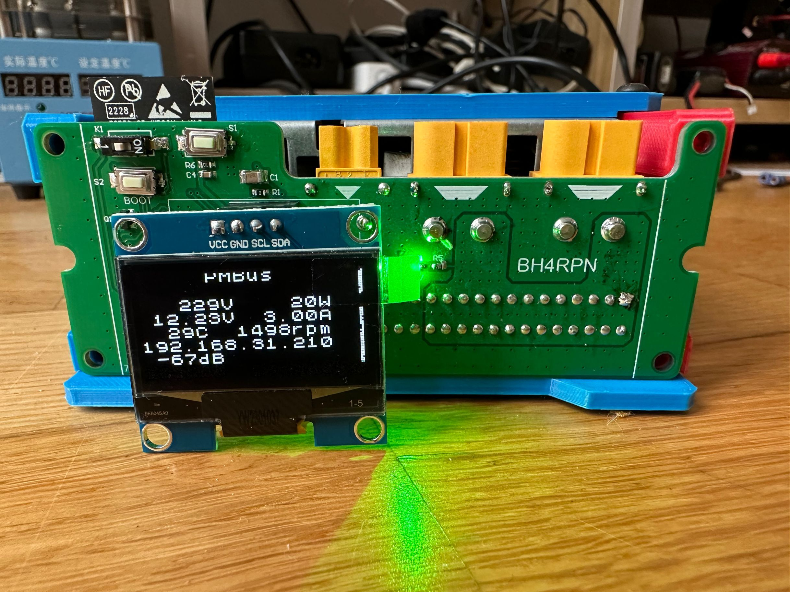
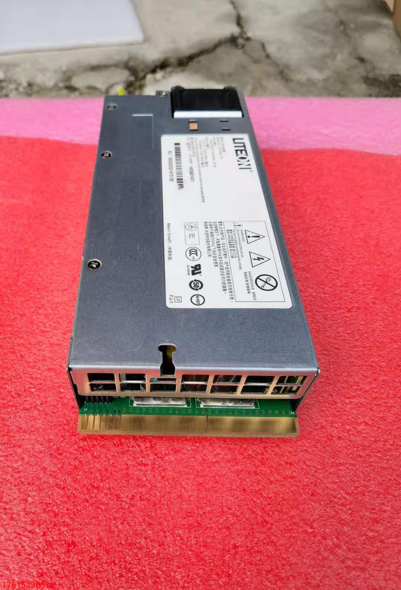

# 光宝，华为系列电源功率，电压电流，风扇转速读取程序

本程序使用Arduino开发，在 华为/光宝  PS-2461-1H-12C上调试通过

##功能
  1. 2个XT60主输出
  2. 1个XT30辅助电源输出，永不停电，可以接光猫等不能断电的设备
  3. 1个4Pin 风扇接口，可以连接12v风扇
  4. 支持oled显示和web监控，通过网络控制电源开关

使用ESP32和ESP32 S3 GPIO的顺序不一样，可以修改，下面是ESP32的编号，源代码里的GPIO是ESP32-S3的

通过ESP32的26，27连接电源的SDA，SCL口，电源内置上拉，可以直接连接
通过ESP32的21，22连接oled的SDA，SCL口，显示

oled的型是SSD1306，4针I2C接口的，注意是VCC开头，不是gnd开头

This is an Arduino program designed to read power, voltage, current, and fan speed data from the Power Supply Units of the Huawei and Delta brands. It has been tested on the Delta PS-2461-1H-12C power supply.

This program supports both OLED display and web display. It connects to the power supply's SDA and SCL pins via the ESP32's 26 and 27 pins, respectively. The power supply has built-in pull-ups, so it can be connected directly. The SSD1306 OLED display is connected to SDA and SCL pins via the ESP32's 21 and 22 pins, respectively.

The OLED display uses a 4-pin I2C interface.

* Libraries
  * https://github.com/olikraus/u8g2
 
